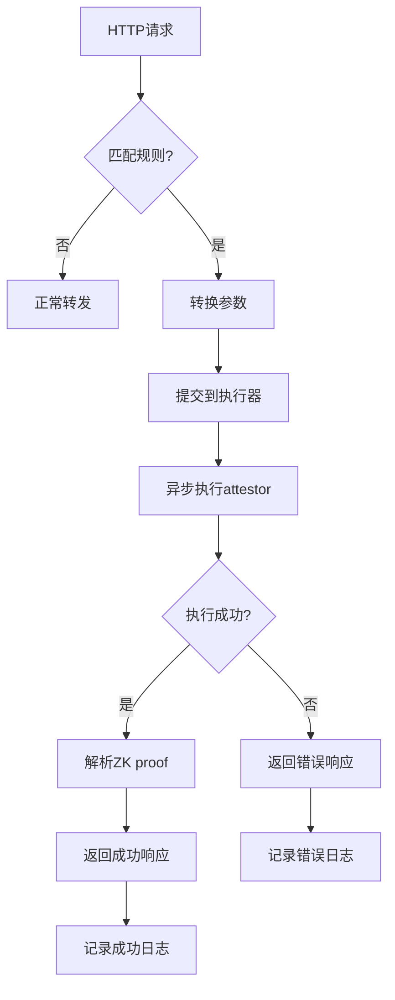

# Attestor集成转发Addon

将mitmproxy与Reclaim Protocol的attestor node集成，实现自动化的ZK proof生成和验证流程。

## 🎯 功能特性

- ✅ **智能请求识别**：根据配置规则自动识别需要attestor处理的API请求
- ✅ **参数自动转换**：将HTTP请求自动转换为attestor调用参数
- ✅ **异步执行**：使用线程池异步执行attestor命令，不阻塞代理流程
- ✅ **响应处理**：解析attestor返回的ZK proof并生成结构化响应
- ✅ **错误处理**：完善的错误处理和超时机制
- ✅ **配置驱动**：通过JSON配置文件灵活控制转发规则

## 📦 文件结构

```
mitmproxy_addons/
├── attestor_forwarding_addon.py       # 主要addon实现
├── attestor_forwarding_config.json    # 配置文件
├── test_attestor_addon.py             # 测试脚本
├── http_to_attestor_converter.py      # HTTP转换器（依赖）
└── README_attestor_addon.md           # 本文档
```

## 🚀 快速开始

### 1. 环境准备

确保以下环境已配置：
- Python 3.7+
- mitmproxy
- attestor-core 项目（在 `../attestor-core` 目录）

### 2. 启动mitmproxy

```bash
# Web界面模式（推荐）
mitmweb -s attestor_forwarding_addon.py --web-port 8081

# 命令行模式
mitmproxy -s attestor_forwarding_addon.py

# 透明代理模式
mitmdump -s attestor_forwarding_addon.py
```

### 3. 配置浏览器代理

将浏览器代理设置为：
- HTTP代理：127.0.0.1:8080
- HTTPS代理：127.0.0.1:8080

### 4. 访问目标网站

访问配置中定义的银行网站或API，addon会自动：
1. 识别匹配的请求
2. 转换为attestor参数
3. 异步执行attestor命令
4. 返回包含ZK proof的响应

## ⚙️ 配置说明

### 主要配置项

#### global_settings
```json
{
  "enable_logging": true,
  "log_level": "INFO",
  "attestor_core_path": "../attestor-core",
  "max_workers": 3,
  "request_timeout": 60
}
```

#### attestor_rules
```json
{
  "enabled": true,
  "rules": [
    {
      "name": "招商永隆银行余额查询",
      "domains": ["*.cmbwinglungbank.com"],
      "paths": ["/ibanking/.*"],
      "methods": ["POST", "GET"],
      "response_patterns": {
        "hkd_balance": "HKD[^\\\\d]*(\\\\d[\\\\d,]*\\\\.\\\\d{2})"
      },
      "geo_location": "HK",
      "enabled": true
    }
  ]
}
```

### 规则匹配逻辑

1. **域名匹配**：支持精确匹配和通配符匹配（`*.domain.com`）
2. **路径匹配**：支持正则表达式匹配
3. **方法匹配**：支持HTTP方法过滤
4. **启用状态**：每个规则可以单独启用/禁用

## 🔄 工作流程



## 📊 响应格式

### 成功响应
```json
{
  "status": "success",
  "task_id": "task_123_1754392081",
  "attestor_result": {
    "claim": {
      "extractedParameters": {
        "hkd_balance": "1000.00",
        "usd_balance": "500.00"
      }
    }
  },
  "processed_at": "2025-08-05T18:00:00Z"
}
```

### 错误响应
```json
{
  "status": "error",
  "task_id": "task_124_1754392082",
  "error": "Command timeout",
  "processed_at": "2025-08-05T18:00:00Z"
}
```

### 处理中响应
```json
{
  "status": "processing",
  "message": "Request is being processed with attestor",
  "task_id": "task_125_1754392083"
}
```

## 🧪 测试

运行测试脚本：
```bash
python3 test_attestor_addon.py
```

测试覆盖：
- ✅ Attestor执行器功能
- ✅ 域名和路径匹配
- ✅ 规则启用/禁用
- ✅ 参数转换
- ✅ 响应解析
- ✅ 完整工作流程

## 📝 日志和监控

### 日志文件
- `logs/attestor_forwarding.log` - 主要日志
- `logs/attestor_metrics.json` - 性能指标

### 关键指标
- `total_requests` - 总请求数
- `attestor_requests` - 通过attestor处理的请求数
- `attestor_success` - 成功处理数
- `attestor_failures` - 失败处理数
- `attestor_errors` - 错误数

## 🔧 故障排除

### 常见问题

1. **attestor-core路径错误**
   ```
   ❌ Attestor执行器初始化失败: [Errno 2] No such file or directory
   ```
   解决：检查配置中的`attestor_core_path`是否正确

2. **命令执行超时**
   ```
   ⏰ Attestor任务 task_xxx 执行超时
   ```
   解决：增加`request_timeout`配置或检查attestor-core环境

3. **规则不匹配**
   ```
   请求未被attestor处理
   ```
   解决：检查域名、路径、方法匹配规则和enabled状态

4. **JSON解析失败**
   ```
   解析状态: False
   ```
   解决：检查attestor输出格式或查看raw_output

### 调试模式

启用调试模式：
```json
{
  "development": {
    "debug_mode": true,
    "save_requests": true,
    "save_responses": true
  }
}
```

## 🔒 安全考虑

1. **私钥管理**：配置文件中的私钥仅用于测试，生产环境请使用环境变量
2. **域名白名单**：配置`security.allowed_domains`限制处理范围
3. **请求大小限制**：配置`security.max_request_size`防止大文件攻击
4. **HTTPS要求**：配置`security.require_https`强制HTTPS

## 🚀 性能优化

1. **工作线程数**：根据服务器性能调整`max_workers`
2. **超时设置**：合理设置`request_timeout`平衡响应时间和成功率
3. **日志级别**：生产环境使用`WARN`或`ERROR`级别
4. **指标监控**：定期检查`attestor_metrics.json`

## 🔄 扩展开发

### 添加新的处理规则

1. 在配置文件中添加新规则：
```json
{
  "name": "新银行API",
  "domains": ["*.newbank.com"],
  "paths": ["/api/.*"],
  "methods": ["GET"],
  "response_patterns": {
    "balance": "balance.*?(\\d+\\.\\d{2})"
  },
  "geo_location": "US",
  "enabled": true
}
```

2. 重启mitmproxy即可生效

### 自定义响应处理

修改`_handle_attestor_response`方法来自定义响应格式和处理逻辑。

### 集成其他attestor

修改`AttestorExecutor`类来支持不同的attestor实现。

## 📞 支持

如有问题，请检查：
1. 日志文件中的错误信息
2. attestor-core环境是否正常
3. 配置文件格式是否正确
4. 网络连接是否正常
