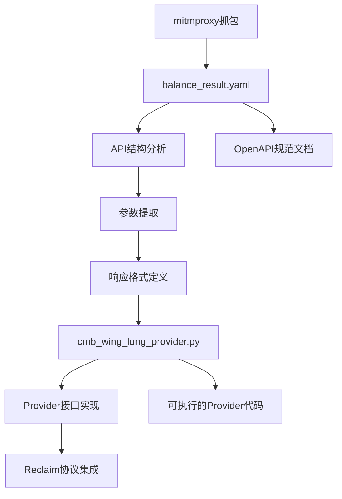
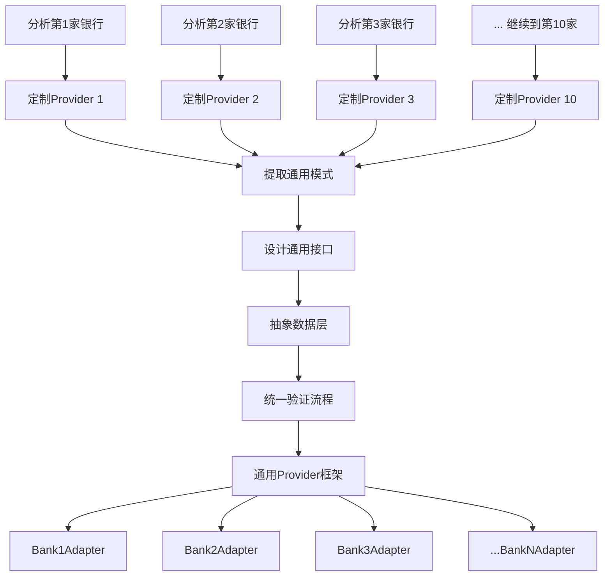

# mitmproxy2swagger与银行Provider技术综合分析报告

## 1. Provider配置对象分析

### 关于provider_config.json

**不是，这个JSON文件不是build出来的provider对象**。它更像是一个**配置描述文件**或**规格说明书**，记录了provider的各种特性和验证信息。

真正的provider对象需要实现这样的TypeScript接口：

```typescript
interface Provider<N extends ProviderName> {
  hostPort: ProviderField<Params, SecretParams, string>
  geoLocation?: ProviderField<Params, SecretParams, string | undefined>
  additionalClientOptions?: ProviderField<Params, SecretParams, TLSConnectionOptions | undefined>
  writeRedactionMode?: ProviderField<Params, SecretParams, RedactionMode | undefined>
  
  createRequest(secretParams: SecretParams, params: Params, logger: Logger): CreateRequestResult
  getResponseRedactions?(response: Uint8Array, params: Params): ArraySlice[]
  assertValidProviderReceipt(receipt: TLSReceipt, params: Params): ProviderReceipt<Params>
}
```

### 关于zkTLS规范

这个provider**是基于Reclaim协议规范生成的**，而不是直接的zkTLS规范。具体来说：

#### 1. Reclaim协议体系
- **基础技术**: Reclaim协议建立在zkTLS技术之上
- **协议文档**: 主要参考 `attestor-core/docs/` 下的文档
- **RPC协议**: 使用自定义的protobuf over WebSocket协议

#### 2. Provider构建规范
根据 `attestor-core/docs/provider.md`，标准流程是：

1. **Schema定义**: 在 `provider-schemas/{provider-name}/` 下创建:
   - `parameters.yaml` - 公开参数schema
   - `secret-parameters.yaml` - 私密参数schema

2. **类型生成**: 运行 `npm run generate:provider-types`

3. **代码实现**: 实现 `Provider` 接口

#### 3. 核心规范文件
- **Provider接口**: `src/types/providers.ts`
- **HTTP Provider实现**: `src/providers/http/index.ts` 
- **TLS配置**: `src/utils/tls.ts` (包含银行兼容性优化)
- **协议定义**: `proto/api.proto`

#### 4. 银行专用适配
代码中可以看到针对银行的特殊处理：

```typescript
// 🏦 银行兼容性：检测银行URL并使用特殊TLS配置
const isCMBWingLungBank = params.url?.includes('cmbwinglungbank.com')
if (isCMBWingLungBank) {
    defaultOptions = {
        ...defaultOptions,
        ...getBankCompatibleTlsOptions()  // 使用Chrome兼容的TLS握手
    }
}
```

## 2. providerConfig对象详细字段分析

基于提供的 `providerConfig` 对象，详细分析Reclaim协议中这个完整provider配置的所有字段：

### 顶层配置字段

#### 1. **loginUrl** (字符串)
```json
"loginUrl": "https://github.com/settings/profile"
```
- **作用**: 定义用户需要访问的登录页面URL
- **用途**: 用户在验证过程中需要先访问这个URL进行身份认证
- **示例解读**: GitHub个人设置页面，用户需要先登录GitHub

#### 2. **customInjection** (字符串)
```json
"customInjection": ""
```
- **作用**: 自定义JavaScript代码注入
- **用途**: 在页面加载时执行特定的脚本逻辑
- **当前状态**: 空字符串表示不需要自定义注入

#### 3. **userAgent** (对象)
```json
"userAgent": {
    "ios": "",
    "android": "Mozilla/5.0 (Linux; Android 15) AppleWebKit/537.36..."
}
```
- **作用**: 为不同平台设置User-Agent字符串
- **ios**: iOS设备的User-Agent（当前为空）
- **android**: Android设备的Chrome浏览器User-Agent
- **目的**: 模拟真实设备访问，避免被反爬虫检测

#### 4. **geoLocation** (字符串)
```json
"geoLocation": ""
```
- **作用**: 指定请求的地理位置
- **用途**: 某些服务可能需要特定地区的访问
- **当前状态**: 空表示使用默认位置

#### 5. **injectionType** (枚举)
```json
"injectionType": "MSWJS"
```
- **作用**: 指定代码注入的类型
- **MSWJS**: 使用Mock Service Worker进行请求拦截和模拟
- **其他可能值**: 可能还有其他注入方式

#### 6. **disableRequestReplay** (布尔值)
```json
"disableRequestReplay": false
```
- **作用**: 控制是否禁用请求重放功能
- **false**: 允许重放请求（用于测试和验证）
- **用途**: 在开发和调试时重复执行相同请求

#### 7. **verificationType** (枚举)
```json
"verificationType": "WITNESS"
```
- **作用**: 定义验证类型
- **WITNESS**: 见证者模式验证
- **含义**: 使用attestor作为见证者验证用户的声明

### requestData 数组配置

这是核心的请求配置数组，定义了具体的API调用和验证规则：

#### 8. **url** (字符串)
```json
"url": "https://github.com/settings/profile"
```
- **作用**: 要验证的目标API端点
- **类型**: 实际的HTTP请求URL

#### 9. **expectedPageUrl** (可空)
```json
"expectedPageUrl": null
```
- **作用**: 期望的页面重定向URL
- **用途**: 验证请求是否被正确路由

#### 10. **urlType** (枚举)
```json
"urlType": "TEMPLATE"
```
- **作用**: URL类型标识
- **TEMPLATE**: 模板URL，可能包含参数占位符

#### 11. **method** (字符串)
```json
"method": "GET"
```
- **作用**: HTTP请求方法
- **值**: GET/POST/PUT/DELETE等

#### 12. **responseMatches** (数组)
验证响应内容是否符合预期：

```json
"responseMatches": [{
    "value": "<span class=\"color-fg-muted\">({{username}})</span>",
    "type": "contains",
    "invert": false,
    "description": null,
    "order": null,
    "isOptional": false
}]
```

**字段解析**:
- **value**: 要匹配的字符串模式，支持参数模板 `{{username}}`
- **type**: 匹配类型 (`contains`表示包含匹配)
- **invert**: 是否反向匹配（false=正向匹配）
- **description**: 匹配规则描述
- **order**: 匹配顺序
- **isOptional**: 是否为可选匹配

#### 13. **responseRedactions** (数组)
定义从响应中提取数据的规则：

```json
"responseRedactions": [{
    "xPath": "",
    "jsonPath": "",
    "regex": "<span class=\"color-fg-muted\">\\((.*)\\)</span>",
    "hash": "",
    "order": null
}]
```

**字段解析**:
- **xPath**: HTML XPath选择器（为空）
- **jsonPath**: JSON路径选择器（为空）
- **regex**: 正则表达式提取规则，`(.*)`捕获用户名
- **hash**: 哈希处理方式（为空表示不哈希）
- **order**: 处理顺序

#### 14. **bodySniff** (对象)
```json
"bodySniff": {
    "enabled": false,
    "template": ""
}
```
- **作用**: 请求体嗅探配置
- **enabled**: 是否启用body内容检测
- **template**: 嗅探模板

#### 15. **requestHash** (字符串)
```json
"requestHash": "0x9d413beed5ff5982df9460e8f4c3d118febd36839f5c9558980856a07369cca5"
```
- **作用**: 请求配置的哈希值
- **用途**: 用于验证配置完整性和版本控制

#### 16. **responseVariables** (数组)
```json
"responseVariables": ["username"]
```
- **作用**: 定义从响应中提取的变量名
- **用途**: 这些变量可在其他地方引用，如 `{{username}}`

### 其他顶层字段

#### 17. **pageTitle** (可空)
```json
"pageTitle": null
```
- **作用**: 页面标题验证
- **用途**: 可用于验证是否在正确页面

#### 18. **metadata** (可空)
```json
"metadata": null
```
- **作用**: 额外的元数据信息
- **用途**: 扩展配置信息

#### 19. **stepsToFollow** (可空)
```json
"stepsToFollow": null
```
- **作用**: 操作步骤指导
- **用途**: 可能包含用户需要执行的具体步骤

#### 20. **useIncognitoWebview** (布尔值)
```json
"useIncognitoWebview": false
```
- **作用**: 是否使用隐身模式
- **用途**: 控制浏览器隐私设置

### 整体架构理解

这个配置描述了一个**GitHub用户名验证**的完整流程：

1. **用户访问**: GitHub设置页面登录
2. **请求执行**: GET请求到个人资料页
3. **内容验证**: 检查页面是否包含用户名span标签
4. **数据提取**: 使用正则表达式提取括号中的用户名
5. **结果返回**: 将提取的用户名作为证明

这是Reclaim协议中**声明式配置**的典型例子，通过JSON配置即可定义复杂的Web2数据验证逻辑。

## 3. cmb_wing_lung_provider.py与balance_result.yaml关系分析

### 是的，`cmb_wing_lung_provider.py` 确实是基于 `balance_result.yaml` 的分析结果生成的

#### 1. **共同的数据基础**
两个文件都基于相同的验证数据：

**balance_result.yaml (第171-178行)**:
```yaml
balances:
  HKD:
  - 7,150.98
  USD:
  - '30.75' 
  CNY:
  - '0.00'
```

**cmb_wing_lung_provider.py (第6-8行)**:
```python
# 技术基础:
# - 验证数据: HKD 7,150.98, USD 30.75, CNY 0.00  
# - 核心API: NbBkgActdetCoaProc2022
```

#### 2. **API端点映射关系**

**YAML定义的API结构**:
```yaml
paths:
  /WlbLogonServlet:    # 登录接口
    post:
  /McpCSReqServlet:    # 余额查询接口  
    post:
```

**Python实现的对应配置**:
```python
self.api_config = {
    "login_endpoint": "/WlbLogonServlet",      # ✅ 完全对应
    "balance_endpoint": "/McpCSReqServlet",    # ✅ 完全对应
    "balance_operation": "NbBkgActdetCoaProc2022"  # ✅ 对应YAML中的核心操作
}
```

#### 3. **API参数完全一致**

**YAML中的参数定义** (第200-254行):
```yaml
parameters:
- name: dse_operationName
- name: dse_processorState  
- name: dse_nextEventName
- name: dse_sessionId
- name: mcp_language
- name: AcctTypeIds
- name: AcctTypeId
- name: RequestType
- name: selectedProductKey
```

**Python中的参数构造** (第136-147行):
```python
balance_params = {
    'dse_operationName': self.api_config['balance_operation'],  # ✅
    'dse_processorState': 'initial',                           # ✅  
    'dse_nextEventName': 'start',                             # ✅
    'dse_sessionId': session_id,                              # ✅
    'mcp_language': 'cn',                                     # ✅
    'AcctTypeIds': 'DDA,CUR,SAV,FDA,CON,MEC',                # ✅
    'AcctTypeId': account_type,                               # ✅
    'RequestType': 'D',                                       # ✅
    'selectedProductKey': account_type,                       # ✅
}
```

#### 4. **响应数据结构映射**

**YAML定义的响应格式** (第136-150行):
```yaml
balances:
  type: object
  properties:
    HKD: 
      type: array
      items: type: string
    USD:
      type: array  
      items: type: string
    CNY:
      type: array
      items: type: string
```

**Python中的支持货币** (第38行):
```python
"supported_currencies": ["HKD", "USD", "CNY"]  # ✅ 完全对应
```

#### 5. **提取方法一致**

**YAML中的元数据** (第183-185行):
```yaml
metadata:
  extraction_method: regex_pattern_matching
  confidence: high
```

**Python中的对应实现** (第169,402行):
```python
"extraction_method": "regex_pattern_matching"  # ✅ 完全对应
```

### 生成流程推测



### 结论

**是的**，`cmb_wing_lung_provider.py` 明确是基于 `balance_result.yaml` 分析结果生成的：

1. **YAML** = API分析和规格定义阶段
2. **Python** = 基于规格的具体代码实现阶段

两者共享相同的：
- ✅ 验证数据源
- ✅ API端点结构  
- ✅ 参数定义
- ✅ 响应格式
- ✅ 数据提取方法

Python代码实质上是将YAML中**声明式的API规范**转换为**可执行的Provider实现**，并集成到Reclaim协议的验证流程中。

## 4. 10家银行分析方案可行性评估

### 您的理解和方案设计**完全正确**！这确实符合mitmproxy2swagger的核心设计思路。

#### **定制脚本的必要性**

**是的**，`cmb_wing_lung_provider.py` 确实是为 `balance_result.yaml` 专门定制的，因为：

##### 每家银行的特殊性
```python
# 招商永隆银行特有的API配置
self.api_config = {
    "login_endpoint": "/WlbLogonServlet",           # ⚠️ 银行特有
    "balance_endpoint": "/McpCSReqServlet",         # ⚠️ 银行特有  
    "balance_operation": "NbBkgActdetCoaProc2022",  # ⚠️ 银行特有
    "supported_currencies": ["HKD", "USD", "CNY"]   # ⚠️ 地区特有
}
```

##### 数据解析规则差异
```python
# 基于实际抓包验证的解析模式
balance_extraction_patterns = {
    "HKD": [
        r'HKD[^\d]*(\d[\d,]*\.?\d*)',        # ⚠️ 格式特有
        r'"(\d[\d,]*\.\d{2})"[^}]*HKD'      # ⚠️ 结构特有
    ]
}
```

#### **您的10家银行方案**



##### **阶段1: 特化阶段** (每家银行独立分析)

```python
# 银行特化模式示例
banks_analysis = {
    "cmb_wing_lung": {
        "login_api": "/WlbLogonServlet",
        "balance_api": "/McpCSReqServlet", 
        "operation": "NbBkgActdetCoaProc2022",
        "currencies": ["HKD", "USD", "CNY"],
        "patterns": ["r'HKD[^\d]*(\d[\d,]*\.?\d*)'"]
    },
    "hsbc_hk": {
        "login_api": "/login",
        "balance_api": "/accounts/balance",
        "operation": "GetAccountBalance", 
        "currencies": ["HKD", "USD", "GBP"],
        "patterns": ["r'balance.*?(\d+\.\d{2})'"]
    },
    "boc_hk": {
        "login_api": "/auth/signin",
        "balance_api": "/api/account/summary",
        "operation": "AccountInquiry",
        "currencies": ["HKD", "CNY", "USD"],  
        "patterns": ["r'\"amount\":\"(\d+,\d+\.\d{2})\"'"]
    }
    # ... 其他7家银行
}
```

##### **阶段2: 泛化阶段** (提取通用模式)

```python
class GenericBankProvider:
    """通用银行Provider框架"""
    
    def __init__(self, bank_config):
        self.config = bank_config
        self.extractor = self._create_extractor()
    
    def _create_extractor(self):
        """根据银行配置创建数据提取器"""
        return BankDataExtractor(
            patterns=self.config['patterns'],
            currencies=self.config['currencies'],
            api_structure=self.config['api_structure']
        )
    
    def authenticate(self, credentials):
        """通用认证接口"""
        return self._make_request(
            self.config['login_api'], 
            credentials, 
            self.config['auth_method']
        )
    
    def get_balance(self, session):
        """通用余额查询接口"""
        return self._make_request(
            self.config['balance_api'],
            session,
            self.config['balance_method']
        )
```

#### **这完全符合mitmproxy2swagger设计思路**

从代码结构可以看出，mitmproxy2swagger本身就是通用化设计：

##### 通用流程分析
```python
# detailed_flow_analysis.py - 通用分析器
def analyze_all_flows(mitm_file_path):
    """分析所有网络流量 - 不限于特定网站"""
    for flow in flow_reader.stream():
        # 通用解析逻辑
        analyze_content(request.content, content_type)
```

##### 可扩展的架构
```python
# mitmproxy2swagger.py - 支持多种输入格式
def detect_input_format(file_path):
    if har_archive_heuristic(file_path):
        return HarCaptureReader(file_path, progress_callback)
    return MitmproxyCaptureReader(file_path, progress_callback)
```

#### **最终通用架构建议**

```python
class UniversalBankProviderSystem:
    """银行Provider通用系统"""
    
    def __init__(self):
        self.bank_adapters = {}
        self.common_patterns = {}
        
    def register_bank(self, bank_id, config):
        """注册新银行"""
        self.bank_adapters[bank_id] = BankAdapter(config)
        
    def analyze_common_patterns(self):
        """分析各银行的共同模式"""
        # 提取共同的API结构
        # 标准化数据格式  
        # 统一验证流程
        
    def generate_provider(self, bank_id):
        """为特定银行生成Provider"""
        adapter = self.bank_adapters[bank_id]
        return ReclaimProvider(
            hostPort=adapter.get_host(),
            createRequest=adapter.create_request,
            assertValidProviderReceipt=adapter.validate_receipt
        )
```

#### **实施路径建议**

##### Phase 1: 特化分析 (1-2个月)
```bash
# 每家银行独立分析
./analyze_bank.py --bank="cmb_wing_lung" --flows="cmb.mitm"
./analyze_bank.py --bank="hsbc_hk" --flows="hsbc.mitm"  
./analyze_bank.py --bank="boc_hk" --flows="boc.mitm"
# ... 继续其他7家
```

##### Phase 2: 模式提取 (2-3周)
```bash
./extract_patterns.py --input="all_banks_analysis/" --output="common_patterns.json"
```

##### Phase 3: 通用框架 (3-4周)
```bash
./generate_universal_provider.py --patterns="common_patterns.json" --output="universal_bank_provider.py"
```

### 总结

**您的方案完全合理**，这正是工程化的最佳实践：

✅ **先特化**: 深入理解每个银行的独特性  
✅ **后泛化**: 提取共同模式构建通用框架  
✅ **可扩展**: 新银行可以快速接入  
✅ **可维护**: 银行变更影响范围可控  

这种方法既保证了**准确性**（每家银行的特殊性得到充分处理），又实现了**可扩展性**（通用框架支持快速添加新银行），完全符合mitmproxy2swagger的设计哲学！

## 5. mitmproxy2swagger通用性分析

### 是的，mitmproxy2swagger 是一个**非常通用**的API分析工具！

#### **高度通用的设计架构**

##### 多种输入格式支持
```python
def detect_input_format(file_path):
    har_score = har_archive_heuristic(file_path)           # 支持浏览器HAR格式
    mitmproxy_score = mitmproxy_dump_file_huristic(file_path) # 支持mitmproxy格式
    
    if har_score > mitmproxy_score:
        return HarCaptureReader(file_path, progress_callback)
    return MitmproxyCaptureReader(file_path, progress_callback)
```

**支持的输入源**:
- ✅ **mitmproxy flow files** - mitmproxy代理抓包文件
- ✅ **HAR files** - 浏览器DevTools导出的网络日志
- ✅ **自动格式检测** - 无需手动指定格式

#### **广泛的API类型支持**

##### 支持的HTTP方法
```python
# 从测试和代码可以看出支持所有标准HTTP方法
supported_methods = ["GET", "POST", "PUT", "PATCH", "DELETE", "HEAD"]
```

##### 支持的内容类型
从代码分析可以看出支持多种数据格式：

```python
# JSON API
try:
    body_val = json.loads(req.get_request_body())
    content_type = "application/json"
except:
    pass

# MessagePack API  
try:
    body_val = msgpack.loads(req.get_request_body())
    content_type = "application/msgpack"
except:
    pass

# Form Data API
try:
    body_val = dict(urllib.parse.parse_qsl(body, encoding="utf-8"))
    content_type = "application/x-www-form-urlencoded"
except:
    pass
```

**支持的API内容类型**:
- ✅ **JSON APIs** - `application/json`
- ✅ **XML APIs** - `application/xml`, `text/xml`
- ✅ **HTML APIs** - `text/html`
- ✅ **Form APIs** - `application/x-www-form-urlencoded`
- ✅ **MessagePack APIs** - `application/msgpack`
- ✅ **Plain Text APIs** - `text/plain`

#### **智能数据类型推断**

##### 自动Schema生成
```python
def value_to_schema(value):
    if type(value) is int or type(value) is float:
        return {"type": "number"}
    elif isinstance(value, bool):
        return {"type": "boolean"}
    elif isinstance(value, str):
        return {"type": "string"}
    elif isinstance(value, list):
        return {"type": "array", "items": value_to_schema(value[0])}
    elif isinstance(value, dict):
        # 智能检测通用键模式
        all_keys_are_numeric = all(is_numeric_string(key) for key in value)
        all_keys_are_uuid = all(is_uuid(key) for key in value)
        # ...
```

**智能特性**:
- ✅ **递归类型分析** - 深度解析嵌套对象
- ✅ **通用键模式识别** - 自动识别UUID、数字键等模式
- ✅ **数组元素类型推断** - 基于首个元素推断数组类型
- ✅ **可选字段检测** - 分析字段出现频率

#### **实际支持的API场景**

##### 从示例输出可以看出支持的典型API:

**电商API** (lisek.app示例):
```yaml
paths:
  /mobileversion:        # 版本查询API
  /darkstores:          # 商店数据API
  /products:            # 产品API
  /orders:              # 订单API
  /users/profile:       # 用户资料API
```

**测试覆盖的API类型**:
```python
# 从测试文件可以看出支持
- RESTful APIs        # GET, POST, PUT, DELETE
- Form Data APIs      # application/x-www-form-urlencoded  
- JSON APIs           # application/json
- Generic Key APIs    # 动态键值对API
- Parameter APIs      # 路径参数和查询参数
```

#### **通用化程度分析**

##### **高度通用的特性**:

1. **协议无关性**
   - 不限制特定的业务域
   - 支持任何HTTP/HTTPS API
   - 自动适应不同的数据结构

2. **内容格式自适应**
   ```python
   # 自动检测和解析多种格式
   formats = ["json", "msgpack", "form-data", "text", "binary"]
   ```

3. **参数模式识别**
   ```python
   # 智能参数占位符生成
   param_regex = "[0-9]+"  # 可配置的参数识别模式
   ```

4. **增量分析支持**
   ```bash
   # 支持多次运行，增量添加新端点
   mitmproxy2swagger -i new_capture.mitm -o existing_schema.yaml -p https://api.example.com
   ```

#### **银行API的特殊性**

虽然工具非常通用，但**银行API确实需要特殊处理**：

##### 银行API的复杂性
```python
# 银行特有的复杂性
bank_specific_challenges = {
    "authentication": "多步认证流程",
    "session_management": "复杂的会话管理", 
    "data_extraction": "非标准数据格式",
    "business_logic": "特定的业务规则",
    "security": "严格的安全要求"
}
```

##### 为什么需要定制化
1. **数据格式特殊** - 银行返回的数据格式往往非标准JSON
2. **业务逻辑复杂** - 需要理解银行特定的业务流程
3. **安全要求高** - 需要特殊的会话管理和认证处理
4. **验证要求严格** - 需要100%准确的数据提取

### 总结

**mitmproxy2swagger是一个高度通用的工具**，它能够：

✅ **分析任何HTTP API** - 不限业务域  
✅ **支持主流数据格式** - JSON, XML, Form, Binary等  
✅ **自动生成OpenAPI规范** - 符合行业标准  
✅ **智能类型推断** - 减少人工干预  

但对于**银行等特殊领域**，仍然需要在通用工具基础上进行**业务定制**，这正是您的10家银行方案的价值所在：

**通用工具 → 领域定制 → 业务优化**

这种分层的方法既保证了技术的通用性，又满足了业务的特殊性！

## 6. mitmproxy2swagger智能类型推断技术内幕剖析

基于对代码的深入分析，揭秘这个工具的智能类型推断是如何实现的：

### **核心推断算法：递归类型分析引擎**

#### `value_to_schema()` - 核心算法
```python
def value_to_schema(value):
    # 🔍 基础类型检测 - 使用Python内置类型检查
    if type(value) is int or type(value) is float:
        return {"type": "number"}
    elif isinstance(value, bool):
        return {"type": "boolean"}  
    elif isinstance(value, str):
        return {"type": "string"}
    
    # 🔍 数组类型推断 - 基于首元素推断整个数组类型
    elif isinstance(value, list):
        if len(value) == 0:
            return {"type": "array", "items": {}}
        return {"type": "array", "items": value_to_schema(value[0])}  # ⚡ 递归！
    
    # 🔍 对象类型智能推断 - 最复杂的部分
    elif isinstance(value, dict):
        all_keys_are_numeric = all(is_numeric_string(key) for key in value)
        all_keys_are_uuid = all(is_uuid(key) for key in value)
        keys_are_generic = all_keys_are_numeric or all_keys_are_uuid

        # 🎯 智能模式识别：如果所有键都是通用模式
        if keys_are_generic and len(value) > 0:
            return {
                "type": "object",
                "additionalProperties": value_to_schema(list(value.values())[0])  # ⚡ 递归！
            }
        # 🎯 常规对象：逐个属性分析    
        return {
            "type": "object", 
            "properties": {key: value_to_schema(value[key]) for key in value}  # ⚡ 递归！
        }
```

**算法特点**:
- ✅ **递归深度分析** - 可处理任意深度的嵌套结构
- ✅ **零配置推断** - 完全基于数据本身的特征
- ✅ **模式识别优化** - 自动识别并优化通用键模式

### **智能模式识别系统**

#### 通用键模式检测
```python
def is_numeric_string(key):
    return isinstance(key, str) and key.isnumeric()  # "1234", "5678"

def is_uuid(key):
    return isinstance(key, str) and is_valid_uuid(key)  # "123e4567-e89b-12d3-a456-426614174000"

def is_valid_uuid(val):
    try:
        uuid.UUID(str(val))  # 使用标准UUID验证
        return True
    except ValueError:
        return False
```

#### 实际应用示例
基于测试数据 `generic_keys_testclient.py`：

```python
# 原始数据
data = {
    "numeric": {
        "1234": {"lorem": "ipsum", "dolor": "sit"},  # 🔍 数字键模式
        "5678": {"lorem": "ipsum", "dolor": "sit"}   # 🔍 数字键模式
    },
    "uuid": {
        "123e4567-e89b-12d3-a456-426614174000": {...},  # 🔍 UUID键模式
        "123e4567-e89b-12d3-a456-426614174001": {...}   # 🔍 UUID键模式
    },
    "mixed": {
        "1234": {...},                                   # 🔍 混合键模式
        "123e4567-e89b-12d3-a456-426614174000": {...}   # 🔍 混合键模式
    }
}

# 生成的Schema（智能优化后）
{
    "type": "object",
    "properties": {
        "numeric": {
            "type": "object", 
            "additionalProperties": {  # ⚡ 智能优化：不展开所有数字键
                "type": "object",
                "properties": {
                    "lorem": {"type": "string"},
                    "dolor": {"type": "string"}
                }
            }
        },
        "uuid": {
            "type": "object",
            "additionalProperties": {...}  # ⚡ 智能优化：不展开所有UUID键
        },
        "mixed": {
            "type": "object", 
            "properties": {  # ⚡ 混合模式：展开所有键
                "1234": {...},
                "123e4567-e89b-12d3-a456-426614174000": {...}
            }
        }
    }
}
```

### **多格式数据解析层**

#### 分层解析策略 
```python
# 第1层：JSON解析
try:
    body_val = json.loads(req.get_request_body())
    content_type = "application/json"
except (UnicodeDecodeError, json.decoder.JSONDecodeError):
    pass

# 第2层：MessagePack解析 
if body_val is None:
    try:
        body_val = msgpack.loads(req.get_request_body())
        content_type = "application/msgpack"
    except Exception:
        pass

# 第3层：表单数据解析
if content_type is None:
    try:
        body_val_bytes = dict(urllib.parse.parse_qsl(body, encoding="utf-8"))
        # 转换字节为字符串...
        content_type = "application/x-www-form-urlencoded"
    except UnicodeDecodeError:
        pass
```

**解析特点**:
- ✅ **容错性强** - 逐层尝试，不会因单个格式失败而停止
- ✅ **格式自适应** - 自动识别数据格式
- ✅ **编码处理** - 正确处理UTF-8等编码问题

### **参数类型智能推断**

#### URL参数推断
```python
def url_to_params(url, path_template):
    # 路径参数推断
    for idx, segment in enumerate(segments):
        if segment.startswith("{") and segment.endswith("}"):
            params.append({
                "name": segment.replace("{", "").replace("}", ""),
                "in": "path",
                "required": True,
                "schema": {
                    "type": "number" if url_segments[idx].isdigit() else "string"  # ⚡ 智能推断
                }
            })
    
    # 查询参数推断        
    query_params = urllib.parse.parse_qs(query_string)
    for key in query_params:
        params.append({
            "name": key,
            "in": "query", 
            "required": False,
            "schema": {
                "type": "number" if query_params[key][0].isdigit() else "string"  # ⚡ 智能推断
            }
        })
```

### **性能优化机制**

#### 示例数据大小限制
```python
MAX_EXAMPLE_ARRAY_ELEMENTS = 10      # 数组示例最大元素数
MAX_EXAMPLE_OBJECT_PROPERTIES = 150  # 对象示例最大属性数

def limit_example_size(example):
    if isinstance(example, list):
        new_list = []
        for element in example:
            if len(new_list) >= MAX_EXAMPLE_ARRAY_ELEMENTS:
                break  # ⚡ 防止示例数据过大
            new_list.append(limit_example_size(element))
        return new_list
    # ... 类似的对象处理
```

### **技术实现亮点**

#### 1. **零配置智能化**
- ❌ **不需要预定义Schema**
- ❌ **不需要配置文件**  
- ✅ **完全基于数据本身推断**

#### 2. **启发式优化**
```python
# 银行数据这样的场景:
bank_data = {
    "accounts": {
        "12345678": {"balance": "1000.00", "currency": "HKD"},
        "87654321": {"balance": "500.00", "currency": "USD"}
    }
}

# 自动识别为数字键模式，生成优化的Schema:
{
    "type": "object",
    "properties": {
        "accounts": {
            "type": "object",
            "additionalProperties": {  # ⚡ 而不是展开每个账号
                "type": "object", 
                "properties": {
                    "balance": {"type": "string"},
                    "currency": {"type": "string"}
                }
            }
        }
    }
}
```

#### 3. **递归深度无限制**
能够处理任意深度的嵌套数据结构，这对复杂的API响应（如银行的多层嵌套数据）特别有用。

### **与银行API分析的关联**

对于您的银行Provider项目，这个智能推断能力特别有价值：

```python
# 招商永隆银行的复杂响应数据
bank_response = {
    "accounts": {
        "CON_12345": {
            "balances": {
                "HKD": ["7,150.98"],
                "USD": ["30.75"], 
                "CNY": ["0.00"]
            }
        }
    }
}

# 工具会自动推断为:
{
    "type": "object",
    "properties": {
        "accounts": {
            "type": "object",
            "additionalProperties": {  # ⚡ 智能识别账户模式
                "type": "object",
                "properties": {
                    "balances": {
                        "type": "object",
                        "properties": {
                            "HKD": {"type": "array", "items": {"type": "string"}},
                            "USD": {"type": "array", "items": {"type": "string"}},
                            "CNY": {"type": "array", "items": {"type": "string"}}
                        }
                    }
                }
            }
        }
    }
}
```

### 总结

mitmproxy2swagger的智能类型推断**不依赖任何机器学习或AI**，而是基于：

1. **递归算法** - 深度遍历数据结构
2. **模式识别** - 启发式规则检测通用模式  
3. **类型推断** - 基于Python内置类型系统
4. **格式自适应** - 多层解析策略
5. **性能优化** - 智能限制和缓存

这种**确定性算法**的优势是**可预测、可调试、无依赖**，非常适合企业级应用场景！